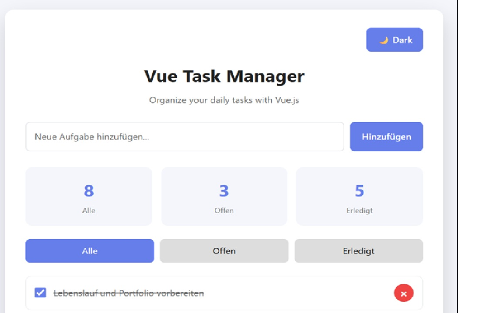

# ✅ Vue Task Manager

A modern task management application built with **Vue.js**.

The application allows users to create, complete, delete and filter tasks. It also includes **Dark Mode**, **Local Storage**, responsive design and smooth UI animations.

---

## 📸 Screenshot



---

## 🚀 Live Demo

Coming soon

---

## ✨ Features

- ➕ Add new tasks
- ✅ Mark tasks as completed
- ❌ Delete tasks
- 🔍 Filter tasks (All / Open / Completed)
- 📊 Live task statistics
- 🌙 Dark Mode
- 💾 Local Storage
- 📱 Responsive Design
- 🎨 Smooth animations
- 🥚 Easter Egg

---

## 🛠 Technologies

- Vue.js 3
- HTML5
- CSS3
- JavaScript (ES6)
- Local Storage API

---

## 📂 Project Structure

```text
vue-task-manager-app/
│
├── index.html
├── style.css
├── app.js
├── screenshot.png
└── README.md
```

---

## 💻 Installation

Clone the repository

```bash
git clone https://github.com/MrBegaS/vue-task-manager-app.git
```

Open the project folder

```bash
cd vue-task-manager-app
```

Run the project by opening

```text
index.html
```

in your browser.

---

## 📚 What I Learned

During this project I practiced:

- Vue.js fundamentals
- Vue directives (`v-model`, `v-for`, `v-if`)
- Computed Properties
- Methods
- Watchers
- Event Handling
- Local Storage
- Responsive Design
- CSS Variables
- Dark Mode
- Browser APIs
- Clean Code principles

---

## 📈 Future Improvements

- Edit existing tasks
- Task categories
- Due dates
- Drag & Drop
- Backend integration
- User authentication

---

## 🎯 Purpose

This project was created as part of my frontend developer portfolio.

The goal was to improve my Vue.js, JavaScript, HTML and CSS skills while building a clean, responsive and user-friendly task management application.

---

## 👨‍💻 Author

**Semir B.**

GitHub: https://github.com/MrBegaS